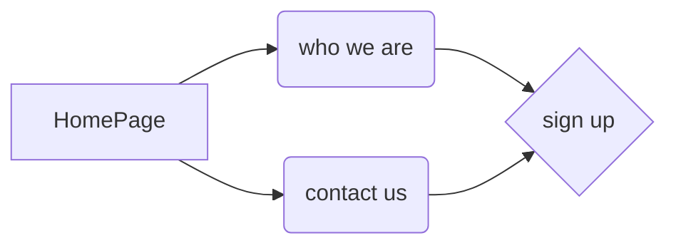

# HTML + CSS (complete responsive web site)

The site consists of three parts: 
 - home page
 - contacts page
 - presentation page 
 

[![Watch the video]]([https://youtu.be/vt5fpE0bzSY](https://vimeo.com/774181136))

<iframe src="https://player.vimeo.com/video/774181136?h=eff358a066&amp;badge=0&amp;autopause=0&amp;player_id=0&amp;app_id=58479" frameborder="0" allow="autoplay; fullscreen; picture-in-picture" allowfullscreen style="position:absolute;top:0;left:0;width:100%;height:100%;" title="Complete responsive web site"></iframe>

