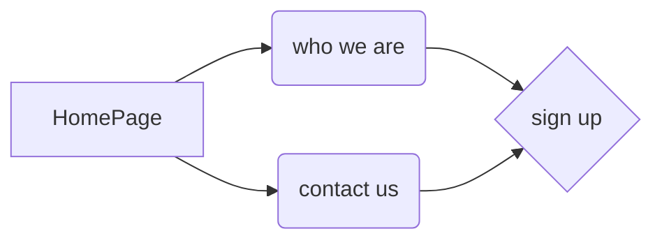

# HTML + CSS (complete responsive web site)

The site consists of three parts: 
 - home page
 - contacts page
 - presentation page 
 

```mermaid
graph LR
A[HomePage] --> B(who we are)
A --> C(contact us)
B --> D{sign up}
C --> D
```

