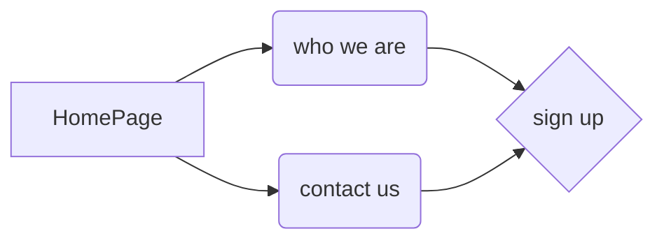

# HTML + CSS (complete responsive web site)

The site consists of three parts: 
 - home page
 - contacts page
 - presentation page 
 

(https://youtu.be/2W1bDbDYQ_o "Now in Android: 55")
[<iframe src="https://player.vimeo.com/video/774181136?h=eff358a066&amp;badge=0&amp;autopause=0&amp;player_id=0&amp;app_id=58479" width="1280" height="720" frameborder="0" allow="autoplay; fullscreen; picture-in-picture" allowfullscreen title="Complete responsive web site"></iframe>]
